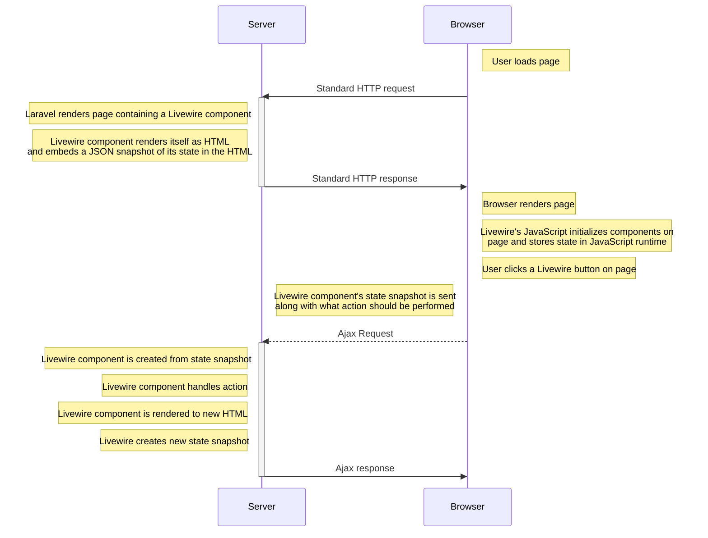

# Places to check when updating

DatabaseSeeder.php
script.sh
.env

[Basic writing and formatting syntax](https://docs.github.com/en/get-started/writing-on-github/getting-started-with-writing-and-formatting-on-github/basic-writing-and-formatting-syntax)

